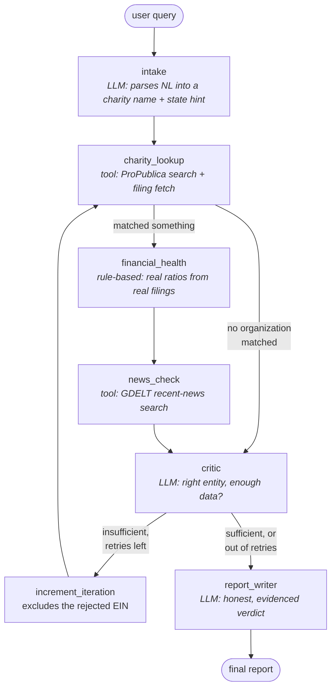

# Charity Due Diligence Agent

A LangGraph agent that checks a charity's real IRS filings and recent news before
you donate, and gives an honest verdict, including when the evidence isn't
strong enough to say either way.

Give it a plain-language description ("is the American Red Cross a well-run
charity?") and it searches ProPublica's real Nonprofit Explorer database for the
organization, computes real financial-health ratios from its actual IRS Form 990
filings, checks recent news for anything a tax filing (which lags a year or two)
wouldn't yet show, and judges whether the match and the data are actually good
enough to trust, retrying with the next-best candidate if it looks like it
matched the wrong entity.

Built for the Agentic AI Bootcamp capstone, applied to a real due-diligence
problem people actually face, not a generic business use case.

## Why this problem, why this architecture

Most "AI charity checker" demos would just look up a name and summarize whatever
comes back. That's a lookup, not a decision aid, and it's exactly the trap this
agent is built to avoid: ProPublica's search for "American Red Cross" returns
eleven results, including an unrelated "881458 American Red Cross Club" and an
"Association Of American Red Cross Retirees", so picking the first hit and
reporting on it can mean confidently answering about the wrong organization
entirely. This agent's actual job is deciding whether the match it found is the
right one and whether the data behind it is recent enough to trust, not just
fetching and formatting a number.

## Architecture



Two real conditional edges:

1. **After `charity_lookup`**: if nothing at all was matched, `financial_health`
   and `news_check` never run, there is nothing to check. No wasted tool calls
   on a name that returned zero results.
2. **After `critic`**: the actual cycle. This exists for a different reason than
   "gather more options": the critic's job is to catch a likely wrong match (a
   same-named chapter, retirees' club, or overseas affiliate ranked ahead of the
   real organization), exclude it, and try the next-best candidate instead. A
   hard, deterministic `max_iterations` cap always wins over the LLM's
   preference, so a model that kept rejecting matches could never turn this into
   an unbounded loop. Both branches are proven by `tests/test_graph_routing.py`,
   which drives the compiled graph with fake tools and a fake LLM and asserts
   the exact call counts each branch should produce.

### Agent roles and prompt design

| Node | Type | Job | Why an LLM (or not) |
|---|---|---|---|
| `intake` | LLM, structured output | Plain language → charity name + optional state | Genuine language understanding needed: people describe charities loosely, not by exact legal name. |
| `charity_lookup` | tool | Queries ProPublica's real search and filing endpoints | No LLM, direct typed API calls. |
| `financial_health` | tool (rule-based) | Computes real ratios from real filing data | Deliberately **not** an LLM: every number is arithmetic a donor could recompute by hand from the same public filing. |
| `news_check` | tool | Searches GDELT for recent controversies | No LLM; see the news-source note below. |
| `critic` | LLM, structured output | Judges whether the match is right and the data is enough, or worth retrying | A fixed rule can't tell "a legitimate organization with an old filing" from "the wrong organization entirely", that's a judgment call, bounded by the hard `max_iterations` guardrail described above. |
| `report_writer` | LLM | Writes the final honest report | Turning structured ratios, filing recency, and news results into prose a donor reads is exactly what an LLM is for; every input is real data the graph already computed, never invented by the model. |

## What was actually verified before being written

- **ProPublica's Nonprofit Explorer API** was confirmed live and keyless before
  this was written: real search results, and a real organization's filing
  history pulled by EIN. Every field name used in `agent/tools/propublica.py`
  was confirmed present by listing all 68 fields on one real filing record, not
  assumed from documentation.
- **The classic "percent to programs" ratio many charity-rating sites publish
  is not computable from this data source**, confirmed the same way: no
  program/management/fundraising expense breakdown exists in ProPublica's
  filing summary, only totals plus specific named line items (officer
  compensation, fundraising income and direct expense). Rather than
  approximate a number this source cannot honestly support, the financial
  health calculator computes what the data actually contains instead: surplus
  ratio, reserve months, executive compensation share, fundraising cost ratio,
  and multi-year revenue trend.
- **The news source choice was deliberate, not the first thing tried.** Google
  News' RSS feed works technically but its own copyright notice explicitly
  restricts it to "personal, non-commercial use... within a personal feed
  reader," which a deployed public tool would violate. NewsAPI.org's free tier
  is documented for development and testing only, not production. GDELT is a
  research project explicitly built for exactly this kind of programmatic
  access, free and keyless, confirmed live before this was written.

## Known limitations

- **GDELT's rate limit is stricter in practice than its own stated "one request
  per 5 seconds."** Testing from this project's development environment (a
  shared cloud sandbox) hit persistent `429` responses even with a 6-second
  throttle plus exponential backoff across 3 attempts, most likely because the
  environment's outbound IP is shared with other, unrelated traffic. The
  `news_check` node treats a persistent failure as "no news check available"
  rather than failing the whole run (`agent/nodes/news_check.py`), and the
  final report says so plainly rather than implying a clean record it never
  actually confirmed. `tests/test_tools_news_search.py` is a real integration
  test against GDELT's live API and may fail intermittently in an environment
  with this same IP-sharing problem; that reflects the API, not the code.
- The financial health calculator's `reserve_months` treats all net assets as
  available reserve. IRS filings distinguish restricted from unrestricted net
  assets, and ProPublica's summary data does not expose that split, so a
  charity with large donor-restricted endowments will show a more generous
  reserve figure than it can actually draw on operationally.
- Intensities of scrutiny are not adjusted by organization size: a very small
  charity with a $50,000 budget and a very large one with a $500 million
  budget are judged by the same ratio thresholds, though what counts as a
  reasonable reserve or executive compensation share can genuinely differ by
  scale.
- This checks financial and news signals only. It cannot detect fraud that
  is well-concealed within legitimate-looking filings, and a "recommended"
  verdict reflects that these signals look normal, not a guarantee.

## Project layout

```
agent/
  state.py                shared graph state
  llm.py                  provider-agnostic chat model, key passed explicitly
  graph.py                wires the nodes and conditional edges together
  nodes/
    intake.py              LLM: query -> structured search
    charity_lookup.py       tool: ProPublica search + filing fetch, retry-aware
    financial_health_node.py wraps the rule-based calculator for the graph
    critic.py               LLM: match/data sufficiency judgment + hard iteration cap
    news_check.py            tool: GDELT search, degrades gracefully on failure
    report_writer.py         LLM: final honest report
  tools/
    propublica.py           real ProPublica API wrapper
    financial_health.py     rule-based ratio calculator, no LLM involved
    news_search.py          real GDELT API wrapper, throttled + retried
api/
  main.py                  FastAPI: submit-and-poll, bring-your-own-key
  jobs.py                  minimal in-memory job store
  schemas.py               request/response models
ui/
  app.py                   Streamlit UI, same bring-your-own-key sidebar
observability/
  logging_config.py        structured logging + LangSmith tracing
tests/                     routing, tool, and API contract tests
```

## Setup

### Run locally

```bash
git clone <this-repo>
cd charity-due-diligence-agent
cp .env.example .env      # fill in one LLM provider key, for local runs only
pip install -r requirements-dev.txt -r requirements.txt -r requirements-ui.txt
```

Command-line demo, no API/UI involved:

```bash
python scripts/run_demo.py "Is the American Red Cross a well-run charity?"
```

Full stack, two terminals:

```bash
# terminal 1
uvicorn api.main:app --reload
# terminal 2
streamlit run ui/app.py
```

The Streamlit UI asks each visitor for their own Anthropic or OpenAI key in its
sidebar. ProPublica and GDELT need no key at all.

### Run with Docker

```bash
docker build -f Dockerfile.api -t charity-agent-api .
docker build -f Dockerfile.ui -t charity-agent-ui .
docker run -p 8000:8000 charity-agent-api
docker run -p 8501:8501 -e API_BASE_URL=http://host.docker.internal:8000 charity-agent-ui
```

### Deploying to Render

`render.yaml` defines both services as a Render Blueprint. **New > Blueprint**,
connect this repo, set `LANGCHAIN_API_KEY` and `API_AUTH_TOKEN` if wanted (no
LLM key needed server-side, it's bring-your-own from the UI), then once the API
service is live, set the UI service's `API_BASE_URL` to its public URL.

### Deploying to Railway / Hugging Face Spaces

The root `Dockerfile` runs both services in one container via `start.sh`,
FastAPI internal-only on `127.0.0.1:8000`, Streamlit on the public port. It
reads `$PORT` dynamically rather than assuming a fixed port, so it works
whichever port value the platform assigns.

### Run the tests

```bash
pytest tests/ -v
```

14 of 15 tests are fully deterministic (no network, no key). One,
`tests/test_tools_propublica.py`, hits ProPublica's live API directly since it
is free and reliably reachable. `tests/test_tools_news_search.py` hits GDELT's
live API and may fail from an environment with a shared or rate-limited IP,
see Known Limitations above, this does not indicate a code defect.

## API

`POST /query` with `{"query": "...", "provider": "anthropic", "api_key": "..."}`
returns `{"job_id": "...", "status": "pending"}`. `GET /query/{job_id}` polls
for the result. An optional `API_AUTH_TOKEN` env var locks the API behind a
bearer token when set.
